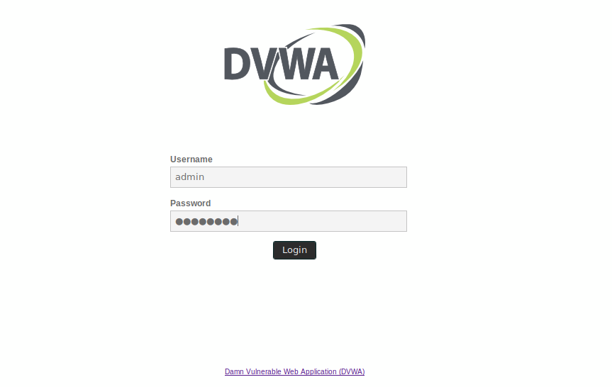

# Script de Fuzzing, Path Traversal y LFI-RFI

Este script te permitira realizar Fuzzing a la pagina web `dvwa`, para extraer informacion utilizando el lenguaje de programacion Python



## Requisitos
-  Python 3.10.10 o verciones anteriores
-  Vitualenv
## Instalacion de Requisitos
```python
pip install -r .\requirements.txt
```


